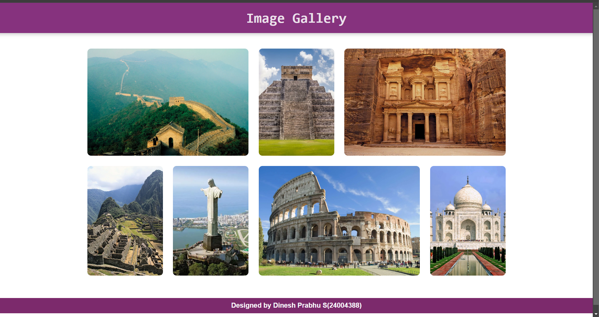

# Ex.08 Design of Interactive Image Gallery
# DATE : 24-12-2024
## AIM
  To design a web application for an inteactive image gallery with minimum five images.

## DESIGN STEPS

## Step 1:

Clone the github repository and create Django admin interface

## Step 2:

Change settings.py file to allow request from all hosts.

## Step 3:

Use CSS for positioning and styling.

## Step 4:

Write JavaScript program for implementing interactivit

## Step 5:

Validate the HTML and CSS code

## Step 6:

Publish the website in the given URL.

## PROGRAM
```
<html>
    <head>
    <title>Image Gallery</title>
    <style>
    body {
    font-family: 'Arial', sans-serif;
    margin: 0;
    padding: 0;
    background: url('pink bg.jpg') no-repeat center center fixed;
    background-size: cover;
    display: flex;
    flex-direction: column;
    align-items: center;
    min-height: 100vh;
    }

    .header {
    text-align: center;
    padding: 20px;
    background-color: rgba(121, 28, 112, 0.9);
    width: 100%;
    box-shadow: 0 4px 10px rgba(0, 0, 0, 0.2);
    font-family: monospace;
    }

    .header h1 {
    font-size: 2.5rem;
    color: #ebe1eb;
    margin: 0;
    }

    .header p {
    font-size: 1.2rem;
    color: #631262;
    }

    .gallery {
    display: grid;
    grid-template-columns: repeat(auto-fit, minmax(200px, 1fr));
    gap: 20px;
    padding: 20px;
    margin: 20px 0;
    width: 90%;
    max-width: 1200px;
    }

    .gallery-item {
    border-radius: 15px;
    overflow: hidden;
    position: relative;
    cursor: pointer;
    border: 5px solid #ffffff;
    transition: transform 0.3s ease, box-shadow 0.3s ease;
    }

    .gallery-item:hover {
    transform: scale(1.05);
    box-shadow: 0 8px 20px rgba(0, 0, 0, 0.3);
    }

    .gallery-item img {
    width: 100%;
    height: 100%;
    object-fit: cover;
    display: block;
    }

    .gallery-item:nth-child(1) {
    grid-column: span 2;
    }

    .gallery-item:nth-child(3),
    .gallery-item:nth-child(6) {
    grid-column: span 2;
    }

    .gallery-item::after {
    content: '';
    position: absolute;
    top: 0;
    left: 0;
    width: 100%;
    height: 100%;
    background: linear-gradient(to bottom right, rgba(255, 255, 255, 0.3), rgba(0, 0, 0, 0.3));
    opacity: 0;
    transition: opacity 0.3s ease;
    }

    .gallery-item:hover::after {
    opacity: 1;
    }

    .footer {
    text-align: center;
    margin-top: 20px;
    padding: 10px;
    width: 100%;
    background-color: rgba(110, 19, 92, 0.9);
    }

    .footer p {
    font-size: 1.2rem;
    color: #f9fafc;
    margin: 0;
    }

    #lightbox {
    display: none;
    position: fixed;
    top: 0;
    left: 0;
    width: 100%;
    height: 100%;
    background: rgba(0, 0, 0, 0.9);
    justify-content: center;
    align-items: center;
    z-index: 1000;
    }

    #lightbox img {
    max-width: 90%;
    max-height: 80%;
    box-shadow: 0 4px 8px rgba(0, 0, 0, 0.5);
    border-radius: 10px;
    }

    #lightbox:target {
    display: flex;
    }

    #lightbox .close {
    position: absolute;
    top: 20px;
    right: 20px;
    background: rgba(255, 255, 255, 0.8);
    border: none;
    font-size: 4rem;
    cursor: pointer;
    border-radius: 50%;
    padding: 5px 10px;
    transition: background 0.3s ease;
    }

    #lightbox .close:hover {
    background: rgba(255, 255, 255, 1);
    }
    </style>
</head>
<body>

<div class="header">
    <h1>Image Gallery</h1>
   
</div>

<div class="gallery">
    <div class="gallery-item" onclick="showAlert('Image 1 clicked!')">
        
    </div>
    <div class="gallery-item" onclick="showAlert('Image 2 clicked!')">
        
    </div>
    <div class="gallery-item" onclick="showAlert('Image 3 clicked!')">
        
    </div>
    <div class="gallery-item" onclick="showAlert('Image 4 clicked!')">
        
    </div>
    <div class="gallery-item" onclick="showAlert('Image 5 clicked!')">
        
    </div>
    <div class="gallery-item" onclick="showAlert('Image 6 clicked!')">
        
    </div>
    <div class="gallery-item" onclick="showAlert('Image 7 clicked!')">
        
    </div>
</div>

<div id="lightbox">
    <button class="close" onclick="closeLightbox()">X</button>

    
</div>

<div class="footer">
    <p><b>Designed by Dinesh Prabhu S(24004388)</b></p>
</div>

<script>
    
    function openLightbox(imageSrc) {
        document.getElementById('lightbox-img').src = imageSrc;
        document.getElementById('lightbox').style.display = 'flex';
    }

    function closeLightbox() {
        document.getElementById('lightbox').style.display = 'none';
    }

    const galleryItems = document.querySelectorAll('.gallery-item');
    galleryItems.forEach(item => {
        item.addEventListener('click', () => {
            const imgSrc = item.querySelector('img').src;
            openLightbox(imgSrc);
        });
    });
</script>

</body>
</html>

```

## OUTPUT




## RESULT
  The program for designing an interactive image gallery using HTML, CSS and JavaScript is executed successfully.
